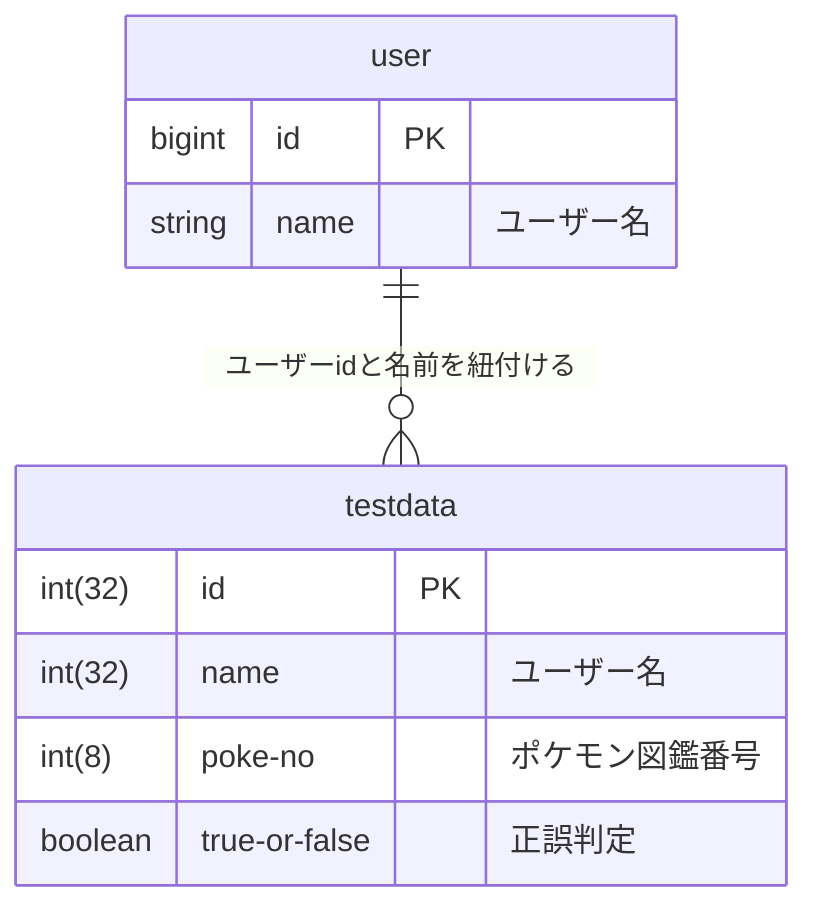

# PokeDict

子供が 4 歳になり、ピカチューだの、リザードンだの言い始めた。

自分は金銀でポケモンの記憶が終了している。

250 匹しか知らん。

今は、1000 匹いる。地獄絵図。

## やりたいこと

ポケモン図鑑をみたい。

ポケモン言えるかなに挑戦だ。

## データの構造

PokeAPI 叩いて、図鑑を見れるようにする。

ランダムにポケモンが表示されて名前を当てる。

正誤表を DB に保管して、間違えたものを復習できるお勉強アプリ。

アメリカ語と日本語対応させたい(add-on で)。

## DB の構造



ユーザー名を取得しておいて、その値と正誤判定結果から間違えたポケモンのリストを取得する。
一度でも間違えたポケモンが苦手リストに入るような形。

間違えたポケモンだけで出題できるようにする。

## フロントエンド側の構成案

作りたいコンテンツを並べてみる。

- Navbar
  - 各ページ遷移のリンクボタン
- ようこそページ
- ポケモン図鑑順番に見る(PokeAPI 使用)
- ポケモン言えるかな？
- 苦手リスト
  - 苦手情報閲覧
  - 再テスト

コンポーネントのイメージ

```javascript
App.jsx
<>
  <Navbar />
  ※stateでmainコンテツ切り替え
  <Wellcome />
  <Dict />
  <Test />
  <List />
  <Retry />
</>

Navbar.jsx
<>
  <button>🏠Home</button>
  <button>📕ポケモン図鑑</button>
  <button>🤔ポケモン言えるかな</button>
  <button>🔎苦手リスト</button>
  <button>🖊再テスト</button>
  <button>💬言語切替</button> //チェックボックス→トグルにしたい
</>

Wellcome.jsx
<>
  <div>ようこそ</div>
  
  <div>君たちは今、</div>
  
  <div>ポケモンを覚えよう</div>
</>

Dict.jsx
<>
  // map関数で複数枚同時に生成
  <div className="card">
  
    <div>ポケモンの名前</div>
    <div>大きさ</div>
    <div>体重</div>
    <div>タイプ</div>
  </div>
  <div>
    <button>戻る</button>
    <button>次へ</button>
  </div>
</>

Test.jsx
<>
  <div>さぁ、ポケモンを答えよう</div>
  <div className="card">
    
  </div>
  <div>だーれだ？</div>
    <input type="text">
  <button>回答する</button>
  <div>
    {correct === null
      ? null
      : correct
      ? "正解！おめでとう！"
      : "やなかんじぃ〜"}
  </div>
</>

List.jsx
<>
  <div>正答率75%以上のポケモンは◯/1000匹です</div> // 余力があれば表示したい
  <div>あなたが間違えたポケモンは以下の通りです</div>
  <div>表敬式コンテンツ</div>
</>

Retry.jsx
<>
  <div>⌛復習の時間だ⌛</div>
  <div className="card">
    
  </div>
  <div>だーれだ？</div>
    <input type="text">
  <button>回答する</button>
  <div>
    {correct === null
      ? null
      : correct
      ? "正解！おめでとう！"
      : "やなかんじぃ〜"}
  </div>
</>


```
