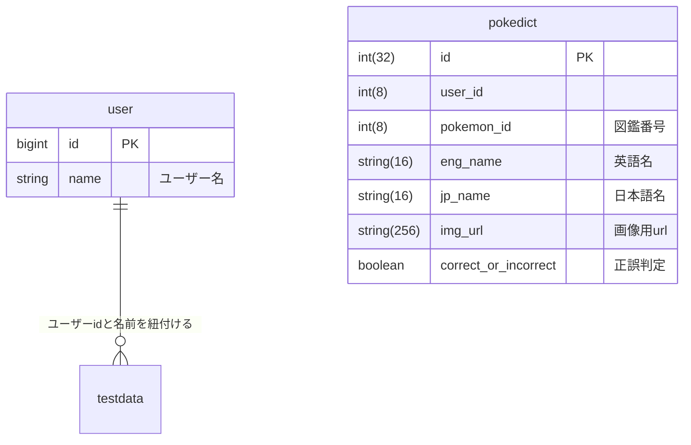

# PokeDict

子供が 4 歳になり、ピカチューだの、リザードンだの言い始めた。

自分は金銀でポケモンの記憶が終了している。

250 匹しか知らん。

今は、1000 匹いる。地獄絵図。

## やりたいこと

ポケモン図鑑をみたい。

ポケモン言えるかなに挑戦だ。

更にテスト機能、復習機能も実装！

## データの構造

ER 図は下記の通り。

なお、google ログイン認証機能を実装予定。それに伴い user テーブルが今後追加される。

## DB の構造

ユーザー名を取得しておいて、その値と正誤判定結果から間違えたポケモンのリストを取得する。
一度でも間違えたポケモンが苦手リストに入るような形。

間違えたポケモンだけで出題できるようにする。

## 今後実装予定機能

最も大事な遊び心機能！

ポケモン図鑑を途中から検索機能！

正答率など詳細な数値データを取得！
